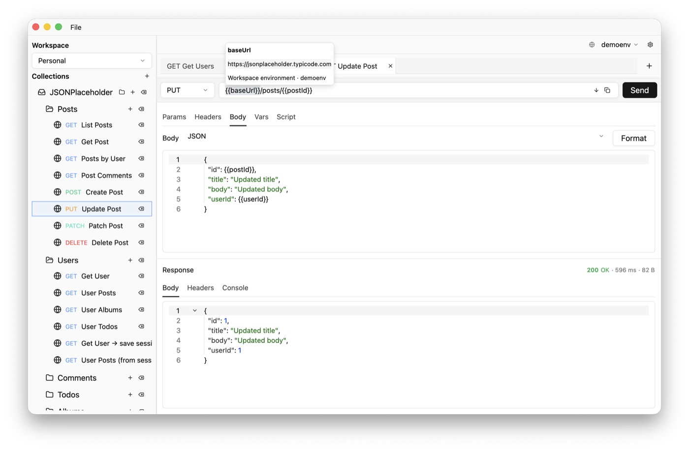

# loom

Desktop HTTP client for macOS, built with Rust and [GPUI](https://github.com/zed-industries/zed) (the UI stack used by Zed).

Send REST requests, organize them in collections, switch environments with variables, inspect responses, and import or export cURL commands — all in a native desktop app.



## Features

- HTTP methods, query params, headers, and multiple body types (JSON, form-data, raw, and more)
- Request collections with folders and tabs
- Environments and variable substitution (`{{variable}}`)
- Response viewer with formatting and timing breakdown
- cURL import and export
- Workspace persistence (YAML on disk)
- Pre-request and test scripts (JavaScript via Boa)

## How loom differs from Postman and Bruno

loom covers the same core workflow — collections, environments, variables, send request, inspect response — but targets a different trade-off: a small native app instead of a full-featured Electron client.

| | **loom** | **Postman** | **Bruno** |
|---|----------|-------------|-----------|
| **Runtime** | Native (Rust + GPUI) | Electron | Electron |
| **Platform** | macOS (for now) | macOS, Windows, Linux | macOS, Windows, Linux |
| **Account / cloud** | Not required; local-first | Cloud workspaces, sync, sharing | Not required; offline-first |
| **Storage** | YAML files on disk | Proprietary + cloud | Plain-text `.bru` files in git |
| **Scope** | HTTP REST, early stage | Broad: mocks, monitors, flows, GraphQL, gRPC, … | HTTP + tests; focused and git-friendly |
| **Scripts** | JavaScript subset (Boa) | Full Postman sandbox (Node APIs) | Bru scripts + JS tests |
| **UI** | Minimal, Zed-like | Feature-rich, heavier | Clean, developer-oriented |


## Requirements

- [Rust](https://rustup.rs/) (edition 2024)

Dependencies on [GPUI](https://github.com/zed-industries/zed) and [gpui-component](https://github.com/longbridge/gpui-component) are pinned to specific git revisions in `Cargo.toml`.

## Build and run

```bash
cargo build
cargo run
```

For a quick compile check after changes:

```bash
cargo check
```

## Project layout

| Path | Purpose |
|------|---------|
| `src/app/` | Application state, tabs, dispatch, UI |
| `src/domain/` | Request/collection/environment types |
| `src/transport/` | HTTP client (reqwest) |
| `src/storage/` | Workspace and app state persistence |
| `src/scripting/` | Pre-request and test script runtime |

## License

MIT — see [LICENSE](LICENSE).
