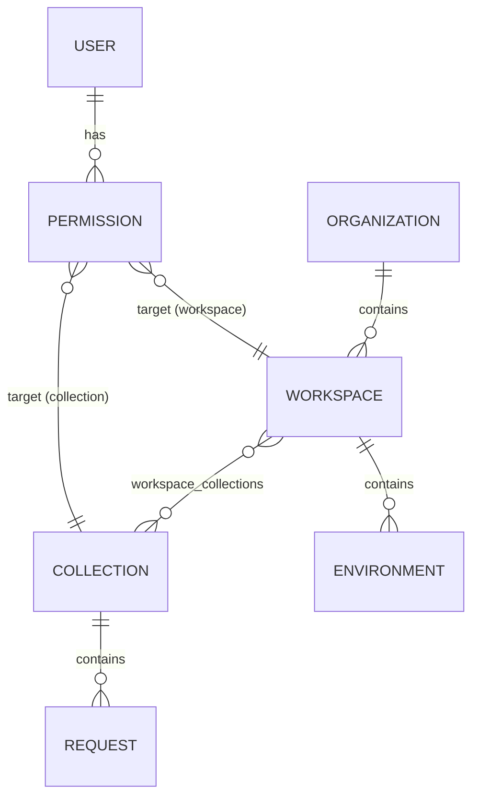
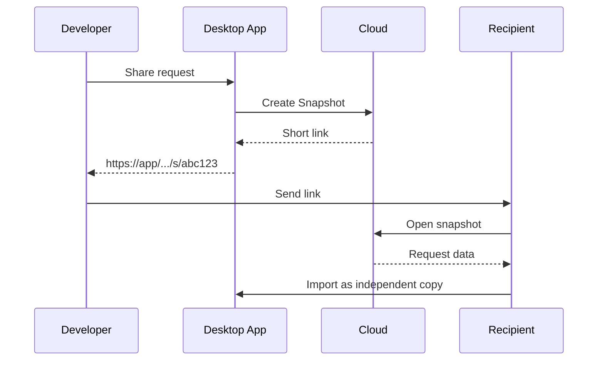

# Architecture Plan

## Hybrid REST Client Concept

**Product vision:** build an API testing client that combines the best of Postman (convenient cloud, one-click collaboration, company admin panel) and Bruno (speed, local file storage, transparent Git workflow).

---

## 1. Key Terms and Entities (Glossary)

| Term | Description |
|------|-------------|
| **Organization** | Top level of the hierarchy in the cloud version. Groups company members and is managed by an administrator through a web panel. |
| **Workspace** | Security and settings context — a "container" that holds shared environments, secrets, access rights, and a list of linked collections. Two isolated types: **local** (a folder on disk) and **cloud** (a space in the server database). |
| **Collection** | A logical folder grouping endpoints for a specific service or module. Contains request structure, automation scripts, and tests. An independent entity — can exist autonomously from a specific workspace. |
| **Request** | A single HTTP / GraphQL / WebSocket request (method, URL, headers, body, scripts). In local mode, stored as a human-readable file (YAML recommended). |
| **Environment** | A set of variables for a specific runtime (Production, Staging, Local). |
| **Snapshot** | A frozen copy of a request or collection uploaded to the cloud for quick sharing via a short link. |

---

## 2. Architectural Concept

### 2.1. Local-Cloud Hybrid (Storage Provider)

The application implements a storage abstraction pattern. The UI does not know where data comes from; it communicates through a `StorageProvider` layer:

```
┌─────────────────────────────────────┐
│           UI / App Layer            │
└─────────────────┬───────────────────┘
                  │
         ┌────────▼────────┐
         │ StorageProvider │  (trait / interface)
         └────────┬────────┘
                  │
      ┌───────────┴───────────┐
      │                       │
┌─────▼──────┐         ┌──────▼───────┐
│   Local    │         │    Cloud     │
│  Provider  │         │   Provider   │
└─────┬──────┘         └──────┬───────┘
      │                       │
  YAML files            PostgreSQL
  on disk               REST / WebSocket
```

| Provider | Purpose |
|----------|---------|
| `LocalStorageProvider` | Works with the local disk. Parses configuration files (YAML recommended for easier Git conflict resolution). |
| `CloudStorageProvider` | Communicates with a remote database (PostgreSQL) over REST / WebSockets. |

### 2.2. Database: Flat Structure with Virtual Nesting

To allow collections to be shared flexibly, independently of workspaces, the database uses a many-to-many relationship:

- A workspace does **not** own collections directly. The `workspace_collections` join table maps their IDs.
- The `permissions` table distributes access via an RBAC model:

```
permissions (
  user_id,
  target_type,   -- 'workspace' | 'collection'
  target_id,
  role           -- 'viewer' | 'editor' | 'admin'
)
```



### 2.3. Variable Hierarchy and Security

Variables are split by visibility level and strictly isolated to prevent leaks:

| Level | Storage | Notes |
|-------|---------|-------|
| Scripts (Pre-request / Tests) | Inside collections / requests | Tied to API logic |
| Public environment variables | In the workspace | Available to all members |
| Secret tokens / passwords | `.env.local` or in-memory session | **Never** committed to Git or sent to the server without encryption |

---

## 3. Access Model and Sharing

Access control follows a top-down model through the admin panel in cloud mode, supplemented with flexible tools.

### 3.1. Workspace Access

An admin grants a user access to a workspace → the user automatically sees all collections within it.

### 3.2. Collection-Only Access

An admin grants access to a single collection only → the user has no access to the foreign workspace; the collection appears in a dedicated system section **"Shared with me"**.

```
┌──────────────────────────────────────────────────────────┐
│  Sidebar                                                 │
├──────────────────────────────────────────────────────────┤
│  ▼ My Workspaces                                         │
│    └─ Backend API (cloud)                                │
│    └─ Local Project (local)                              │
│                                                          │
│  ▼ Shared with me                                        │
│    └─ Payment Service API  ← collection-only access      │
└──────────────────────────────────────────────────────────┘
```

### 3.3. Quick Share

A shortcut around formal access workflows. A developer clicks "Share request / collection" → the app creates a temporary **snapshot** in the cloud and returns a short link for messaging. The recipient imports the data as an independent copy.



---

## Relationship to Current Implementation

The repository currently implements a desktop client with in-memory collections and demo data. Modules `src/domain/`, `src/app/`, and `src/transport/` form the foundation for UI and HTTP transport. Next steps per this plan:

1. `StorageProvider` trait and `LocalStorageProvider` (YAML on disk)
2. Workspace and environment model
3. `CloudStorageProvider` + backend API
4. RBAC, collection sharing, Quick Share / snapshots

Current module structure and GPUI patterns — see [AGENTS.md](../AGENTS.md).
